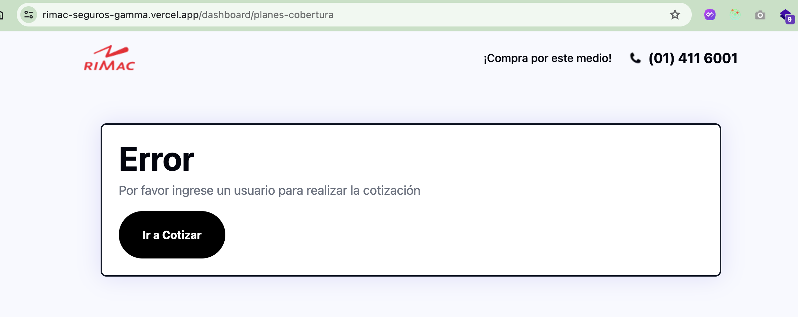
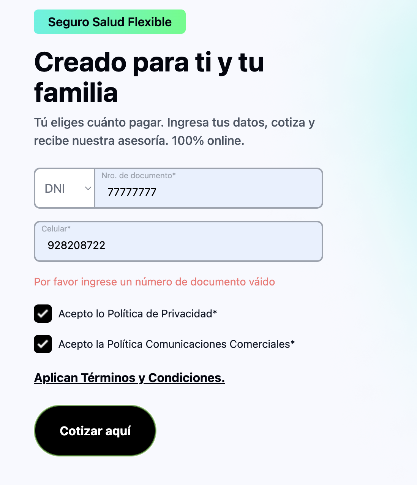
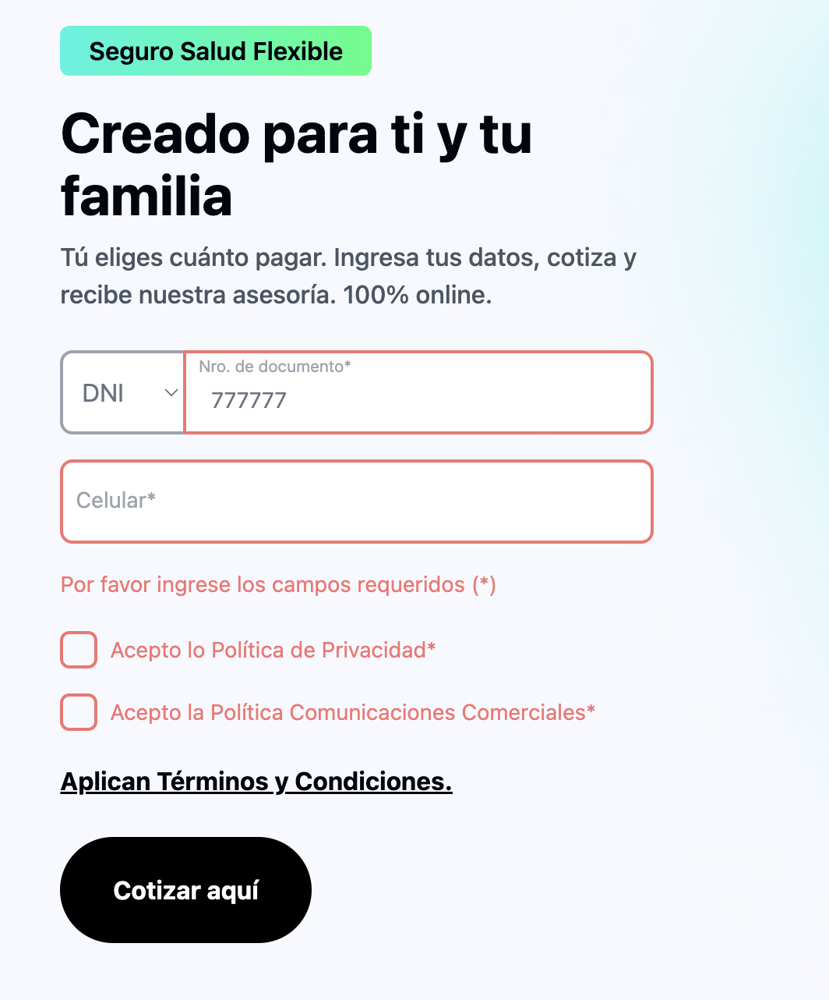
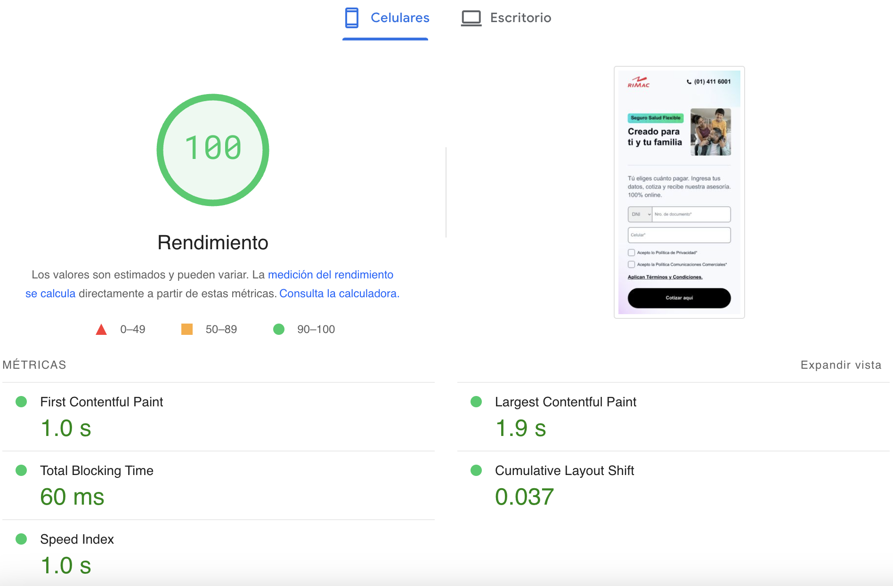

# RIMAC Seguros

## Enlaces

- [Figma](https://www.figma.com/file/KGftIKxhcVm41kTKMsfTh2/Frontend-Challenge-2023?type=design&node-id=12%3A156559&mode=design&t=KfEDYSK5G58rqxia-1)
- [Web](https://rimac-seguros-gamma.vercel.app/)

## Technologies used

- React.js with Next.js
- Typescript
- Sass
- Tailwind
- Context
- Primereact - Carousel

## Endpoints

- `api/user (POST)` : Uso de api para obtener datos (nombres) de usuario a través de su RUC / DNI

## Instalación

- Instalación de modulos

```
npm i
```

- Correr app en local

```
npm run dev
```

## Casos de Usuario (Probados)

### Usuario con DNI / RUC

- Se muestra nombres de persona dueña del RUC/DNI en la vista `dashboard/planes-cobertura`

  

### Usuario ingresa a vistar Planes y Cobertura / Resumen sin ingresar datos

- En caso el usuario no ingrese los datos en el cotizador (formulario) le mostrara un mensaje de error y botón para redirigirlo al cotizador

  

### Validaciones en Cotizador

- Se valida número de documento (mediante API)
- Se valida que los campos no estén vacios

  
  

## Perfomace Tests



- [Tools Pingdom](https://tools.pingdom.com/)

- [PageSpeed Insights](https://pagespeed.web.dev/)
